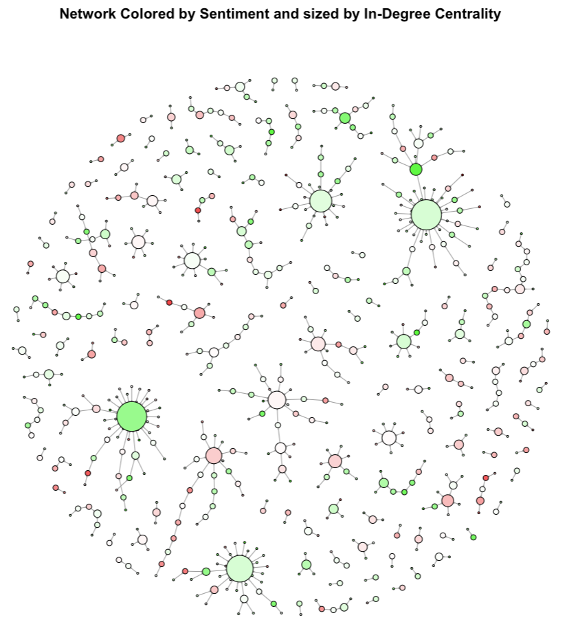
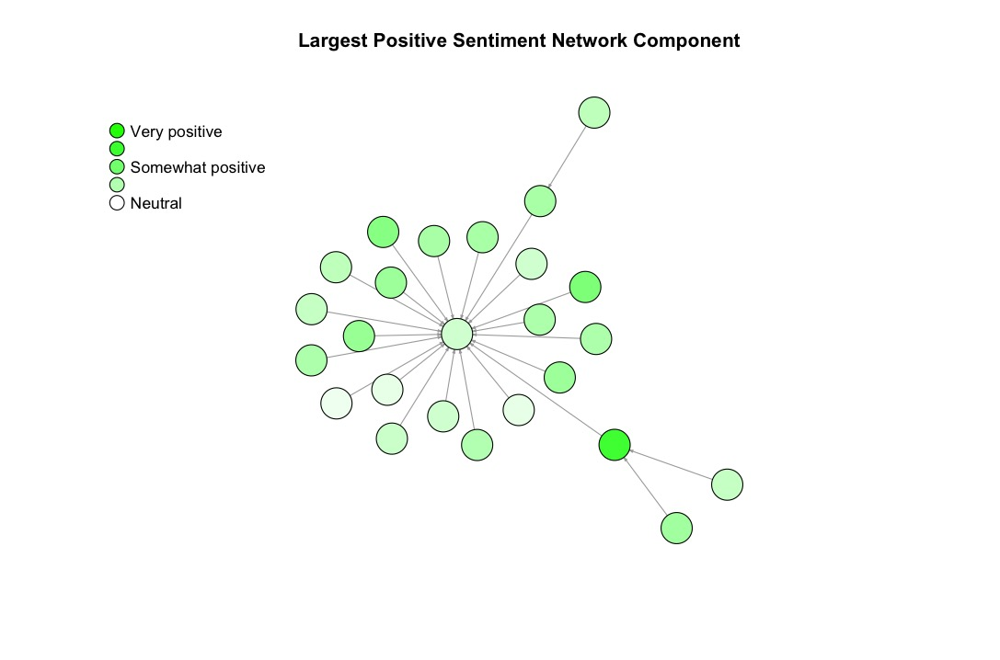
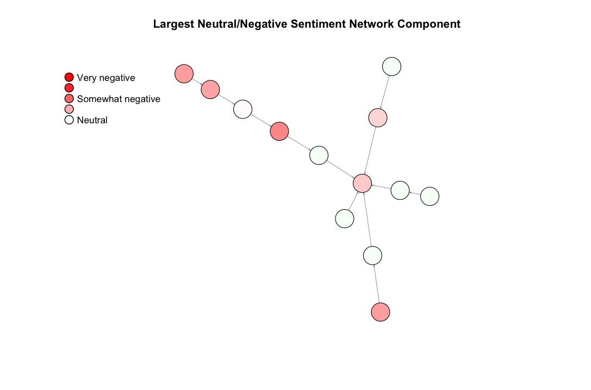

# Reddit Mental Health Sentiment & Network Analysis

This project analyzes conversational dynamics within mental health–related Reddit communities using **sentiment analysis** and **social network analysis**. The goal is to understand how emotional tone flows through discussion threads, how supportive vs. unsupportive exchanges differ structurally, and whether **signed triads** reveal patterns of emotional tension or repair.

## Overview
Using a cleaned dataset of Reddit submissions, comments, and replies, this project:

- Computes sentiment scores for each message using the `sentimentr` package  
- Constructs directed reply networks using `igraph`  
- Identifies key structural patterns such as hubs, chains, and local clusters  
- Examines **triad sentiment flow** (increasing, decreasing, mixed)  
- Visualizes ego networks and sentiment diffusion patterns  
- Explores relationships between engagement, centrality, and supportiveness  

Because Reddit data cannot be shared directly, a small anonymized sample is included for demonstration only.

---

## Methods

### **Sentiment Analysis**
- Calculated using `sentimentr`  
- Averaged per message  
- Visualized via ggplot2  

### **Network Construction**
- Nodes = users  
- Edges = reply relationships  
- Directed graphs built with `igraph`  
- Node color = sentiment  
- Node size = in-degree centrality  

### **Triad Analysis**
- Identified all reply-based triads (A → B → C)  
- Classified triads by sentiment flow: increasing, decreasing, mixed  
- Visualized triads to highlight emotional shifts  

### **Visualization Tools**
- `ggplot2` for scatterplots and histograms  
- `igraph` for network layouts and ego networks  

---

## Repository Structure
```plaintext
reddit_sentiment_network/
├── README.md
├── scripts/
│   └── reddit_analysis.R
├── figures/
│   ├── decreasing_sentiment_flow_triad.jpeg
│   ├── increasing_sentiment_flow_triads.jpeg
│   ├── mixed_sentiment_flow_triads.jpeg
│   ├── ego_network_sentiment.jpeg
│   ├── full_network_sentiment_centrality.jpeg
│   ├── positive_sentiment_subgraph.jpeg
│   ├── negative_sentiment_subgraph.jpeg
│   ├── indegree_vs_sentiment.jpeg
│   ├── engagement_vs_sentiment.jpeg
│   └── sentiment_diffusion_histogram.jpeg
├── data/
│   └── sample_data.csv
└── writeup/
    └── project_paper.pdf
```
---

## Sample Figures



### Positive and Negative Sentiment Subgraphs
<p float="left">
  
  
</p>

---

## Project Paper

The full academic write-up of this study can be found in:

**`writeup/project_paper.pdf`**

It summarizes the motivation, theoretical background (including structural balance theory and sentiment diffusion), methods, and key findings.

---

## Tech Stack

**R**  
- tidyverse  
- igraph  
- sentimentr  
- ggplot2  

---

## Notes on Data

All Reddit data used in this project were collected using the Communalytic platform (https://communalytic.org/).  
Due to ethical and platform restrictions, the full dataset cannot be shared.  

A small synthetic sample (`data/sample_data.csv`) is included only to demonstrate formatting.
